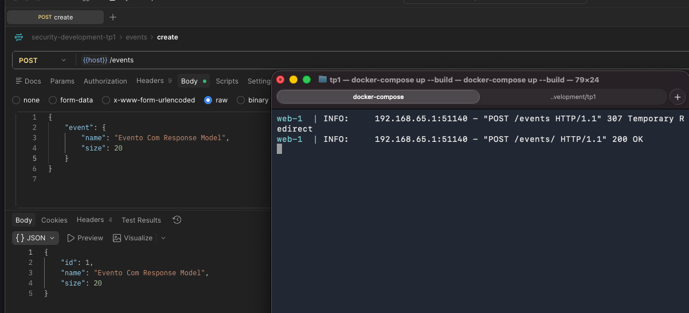
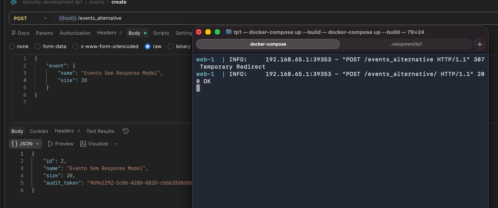

# Escreva uma versão alternativa do mesmo endpoint sem response_model definido e compare, em texto, a resposta JSON retornada nos dois casos.

## Resposta:
Como podemos ver nos prints de responses, o response model filtra o dicionario retornado para incluir somente os valores presentes no response model.